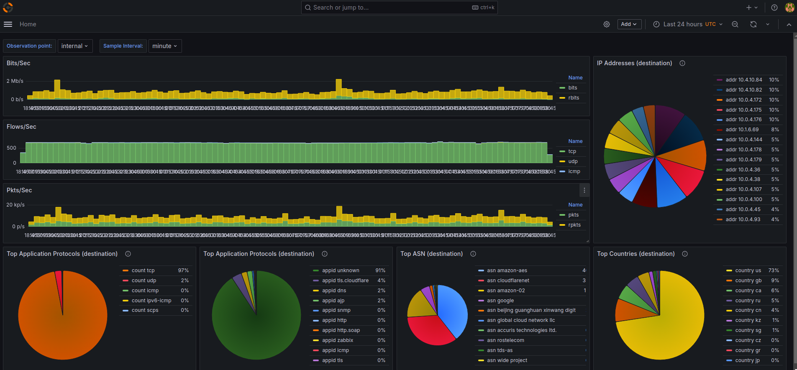
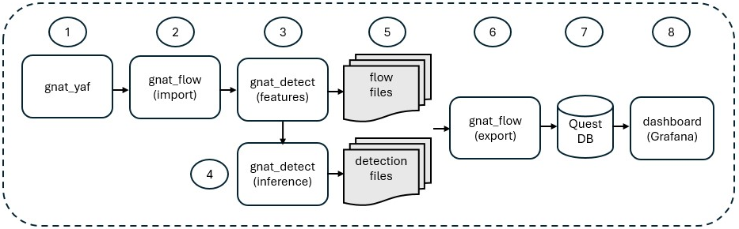
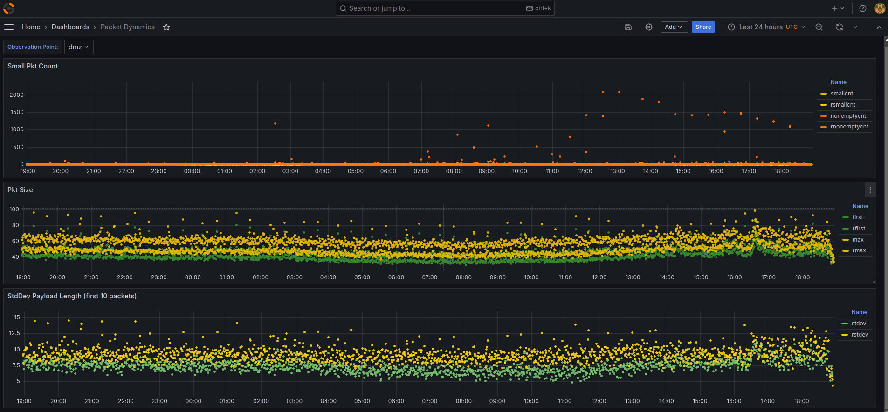
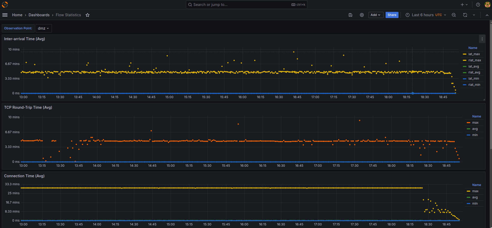

Galileo Network Analytics Toolkit (formerly ShadowMeter) is a microservices-oriented toolkit for building advanced network monitoring and anomaly detection solutions. Designed to be deployed with [Docker](https://www.docker.com/) containers, the toolkit includes unix-like commandline applications implemented in [Rust](https://www.rust-lang.org/).  




Galileo Network Analytics Toolkit includes built-in integration with the following technologies:
- [YAF](https://tools.netsa.cert.org/yaf/)
- [nDPI](https://www.ntop.org/products/deep-packet-inspection/ndpi/)
- [PyTorch](https://www.pytorch.org/)
- [DuckDB](https://duckdb.org/)
- [QuestDB](https://questdb.io/)
- [Grafana](https://grafana.com/oss/grafana/)

##  Design Philosophy

The design of the Galileo Toolkit is motivated by the Unix Philosophy ([Wikipedia](https://en.wikipedia.org/wiki/Unix_philosophy)). More specifically, [Peter H. Salus](https://en.wikipedia.org/wiki/Peter_H._Salus) summarizes the Unix Philosophy, which still rings true, especially with microservices architecture deployed with Docker containers.

```
- Write programs that do one thing and do it well.
- Write programs to work together.
- Write programs to handle text streams, because that is a universal interface
```

## Project Schedule
- [&check;] Phase 1 - Implement a toolkit of commandline applications in Rust.
- [&check;] Phase 2 - Build a Docker container images that integrate commandline applications, YAF, QuestDB , and Grafana.
- [&check;] Phase 3 - Publish a docker-compose.yml as an example of fully functional network monitoring solution (less anomaly detection functions).
- [&nbsp;] Phase 4 - Add anomaly detection commandline application that uses the PyTorch library and docker-compose.yml to demonstrate usage.

## Commandline Applications
The following commandline applications are designed to run in Docker containers:
### 1) gnat_yaf
This commandline application is a modified version of [YAF](https://tools.netsa.cert.org/yaf/) with minor changes including support for [nDPI](https://github.com/ntop/nDPI/tree/4.8-stable).  You can find the changes [here](https://github.com/Fidelis-Farm-Technologies/cert-nsa-yaf/tree/ndpi-4.8).  Although the changes are minor, it is included in the toolkit as **gnat_yaf** to avoid confusion with the official released version of YAF.

### 2) gnat_flow
This commandline application imports and exports flow records:

Using the *"--command=import"* option, gnat_flow converts IFPIX files generated by YAF into Parquet files.  Parquet is the format required by Galileo for analysis, detection, and long term storage.  In addtion to converting the YAF files to Parquet format, gnat_flow optionally enriches the records with ASN and GeoIP information.

Using the *"--command=export"* option, gnat_flow exports flow records in Parquet format to other formats including JSON file, CSV file, or direct insertion into QuestDB.

### 3) gnat_detect
This commandline application generates features and performs inference on flow records:

Using the *"--command=feature"* option, gnat_detect generates a  feature file in Parquet format that corresponds with the records in the input file. The feature file is used to train, evaluate, and perform inference using the Rust bindings for the C++ api of PyTorch.  Since the feature file is in an industry-standard parquet format, other tools can used to extend the processing pipleine.

Using the *"--command=inference"* option, gnat_detect performs inference using the Rust bindings for the C++ api of PyTorch and annotates the record with a score.

## Concept of Operation

1. **gnat_yaf** captures live traffic and generates IPFIX files at regular intervals.
2. **gnat_flow** in "import mode" scans and converts IPFIX files to Arrow/Parquet format.
3. **gnat_detect** in "feature engineering mode" generates feature files
4. **gnat_detect** in "inference mode" generates scores, then stores features with scores in the flow files repository.
5. Data files generated by both instances of **gnat_detect** are stored in the flow files repository.
6. **gnat_flow** in "export mode" exports flow and detection data either in JSON, CSV, or QuestDb format.
7. Data is imported into QuestDB for time-series analysis.
6. Customized Grafana application enables exploration and visualation of network flow records.


## Docker Images

### [Galileo Toolkit](https://hub.docker.com/r/fidelismachine/galileo_toolkit)

This docker image all includes all the commandline applications.  But, it does not include QuestDB or Grafana.
```
docker pull fidelismachine/galileo_toolkit:latest
```

### [Galileo Dashboard](https://hub.docker.com/r/fidelismachine/galileo_dashboard)
This docker image includes a customized version of Grafana.  It is a trimmed down to the minimal required components.
```
docker pull fidelismachine/galileo_dashboard:latest
```

---

## Quick Start with Docker Compose
Although phase 4 is still under development, you can still utilize the Galileo Toolkit to implement an advanced network monitoring solution.  The [docker-compose.yml](docker-compose.yml) file included in this repository is a good example. 

First, create an .env file with the following settings:
```
galileo_INTERFACE="eno1"
galileo_ID="crozet"
galileo_USERNAME="admin"
galileo_PASSWORD="quest"
galileo_DATABASE="questdb:9009"
```
- galileo_INTERFACE -- monitoring network interface
- galileo_ID -- unique sensor id label that will appear in the database
- galileo_USERNAME -- QuestDB username 
- galileo_PASSWORD -- QuestDB password
- galileo_DATABASE -- QuestDB hostname and port number

Then, launch Docker Compose.

```
# docker-compose up -d
```

NOTE: All variable file are mapped to ./var in the local directory.  This includes directories for spooling transient files, QuestDB, and Grafana.

## Exploring the Database
The [QuestDB Web Console](https://questdb.io/docs/web-console/) makes it easy to explore and chart queries using SQL. All flow records are inserted in the flow table. To connect to to the QuestDB Web Console, first set the following environment variable in the docker-compose.yml:
```
QDB_HTTP_ENABLED=true
```

See the [QuestDb documentation](https://questdb.io/docs/reference/sql/overview/) for more details. 

## Flow Table Schema
| field | type      | description    |
| ----- | -------   | -------------- |
| sid   | symbol    | sensor id      |
| sasnorg | symbol  | src ASN organization|
| scountry | symbol  | src country |
| dasnorg | symbol  | dst ASN organization |
| dcountry | symbol  | dst country |
| reason | symbol   | flow termination reason |
| applabel | symbol | application label |
| spd | symbol      | sequence of direction of 1st eight packets |
| stime | timestamp | start time     |
| ltime | timestamp | last time      |
| proto | long      | protocol       |
| saddr | string    | src IP address |
| sport | long      | src port number|
| daddr | string    | dst IP address |
| dport | long      | dst port number|
| sasn | long       | src ASN |
| dasn | long       | dst ASN |
| sutcp | string    | union of src TCP flags |
| dutcp | string    | union of dst TCP flags |
| sitcp | string    | initial src TCP flags |
| ditcp | string    | initial dst TCP flags |
| vlan | long       | VLAN id|
| sdata | long      | total src data (payload) in bytes|
| ddata | long      | total dst data (payload) in bytes|
| sbytes | long     | total src bytes|
| dbytes | long     | total dst bytes|
| sentropy | long   | entropy of src data |
| dentropy | long   | entropy of dst data |
| siat | long       | src average interarrivate time |
| diat | long       | dst average interarrivate time |


| timestamp | timestamp | record insertion time      |

## GeoLite2 ASN tagging
To enable ASN tagging, download **GeoLite2-ASN.mmdb** from [MaxMind](https://dev.maxmind.com/geoip/geolite2-free-geolocation-data). Then, map the file in the volume section of docker-compose.yml to: /var/galileo/maxmind/GeoLite2-ASN.mmdb.  For example, see the [docke-compose file](./docker-compose.yml) in this repository.

## GeoLite2 Countring tagging
To enable Country tagging, download **GeoLite2-Country.mmdb** from [MaxMind](https://dev.maxmind.com/geoip/geolite2-free-geolocation-data). Then, map the file in the volume section of docker-compose.yml to: /var/galileo/maxmind/GeoLite2-Country.mmdb.  For example, see the [docke-compose file](./docker-compose.yml) in this repository.

## Galileo Dashboard

This project includes a [customized Grafana-based docker image](https://hub.docker.com/repository/docker/fidelismachine/galileo_app/general) (aka galileo_dashboard) for visualizing and analyzing flow-based network traffic. Please note, the dashboard are currently under development.



See the galileo_app section in docker-compose.yml file included in this project for details, then refer to the [QuestDB - Grafana tutorial](https://questdb.io/blog/time-series-monitoring-dashboard-grafana-questdb/) to learn how to interact and build custom dashboard.

Note: the default login is:<br>

&emsp;username: admin<br>
&emsp;password: admin<br>

### Galileo Application TLS
galileo App includes an automatically generated self-signed certificate for TLS. To use a certificate signed by a Certificate Authority (CA), map the certificate files in docker-compose.yml. For example, see the galileo_nginx section in docker-compose.yml:
```
  ...
  galileo_proxy:
    image: fidelismachine/galileo_proxy:latest
    restart: unless-stopped 
    volumes:
      - ./var/log/nginx:/var/log/nginx
      # map the signed certificates below
      - ./ssl.crt:/etc/nginx/ssl.crt
      - ./ssl.key:/etc/nginx/ssl.key      
```

## Community

For more information join the community at our [blog](https://galileonetworks.dev).

&copy;2024 Fidelis Farm & Technologies, LLC.
